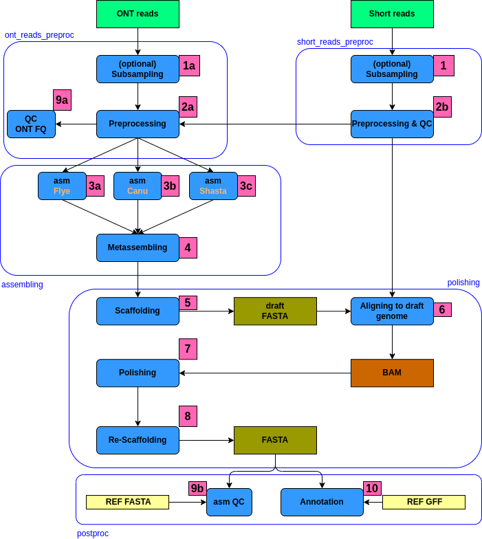

# csp/assembly: Documentation

The csp/assembly documentation is split into the following pages:

- [Usage](usage.md)
  - An overview of how the pipeline works, how to run it and a description of all of the different command-line flags.
- [Output](output.md)
  - An overview of the different results produced by the pipeline and how to interpret them.

!! ДОДЕЛАТЬ
assets/multiqc_config.yml: сконфигурировать отчёт multiQC
nextflow_schema.json

Постараемся покрыть пайплайн готовыми модулями и подпроцессами

Общая структура пайплайна:

Используемые объекты:

| Процесс # | Workflow | Subworkflow | Module | Process | Github | nf-core? | construction | done | comment |
|---|---|---|---|---|---|---|---|---|---|
| 1 |  |  |  |  | mbhall88/rasusa | - |  |  | 
| 1a |  |  |  |  | mbhall88/rasusa | - |  |  | 
| 2a |  |  | filtlong, medaka |  |  | + | +(medaka) |  | 
| 2b |  |  | fastp |  |  | + |  |  | 
| 3a |  |  |  |  | rrwick/Autocycler | - |   |  |
| 3b |  |  |  |  | rrwick/Autocycler | - |   |  |
| 3c |  |  |  |  | rrwick/Autocycler | - |   |  |
| 4 |  |  |  |  | rrwick/Autocycler | - |  |  | Предпочтительно!!! Также можно рассмотреть модуль ragtag_patch
| 5 |  |  | ragtag_scaffold |  |  | + |  |  | 
| 6 |  |  | bwamem2_index, bwamem2_mem |  |  | + |  |  |
| 7 |  |  | pilon |  |  | + |  |  |  | 
| 8 |  |  | longstitch |  |  | + | + | + | 
| 9a |  |  | sequali |  |  | + |  |  | 
| 9b |  |  | quast, busco_busco, merqury_merqury |  |  | + |  |  | 
| 10 |  |  | liftoff |  |  | + |  |  | 

Дополнительные объекты:
 - субпроцессы:
    - <b>utils_nextflow_pipeline</b> - покажет версию пайплайна, сохранит параметры в json (используется в самом начале);
    - <b>utils_nfschema_plugin</b> - валидирует параметры, покажет параметры, отличные от параметров по умолчанию (используется после <b>utils_nextflow_pipeline</b>)